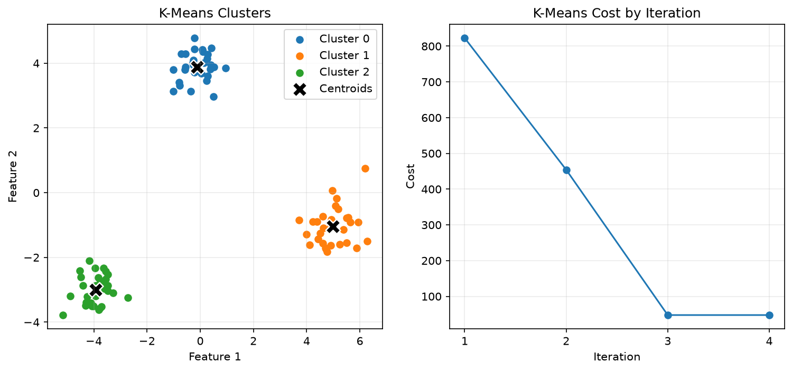
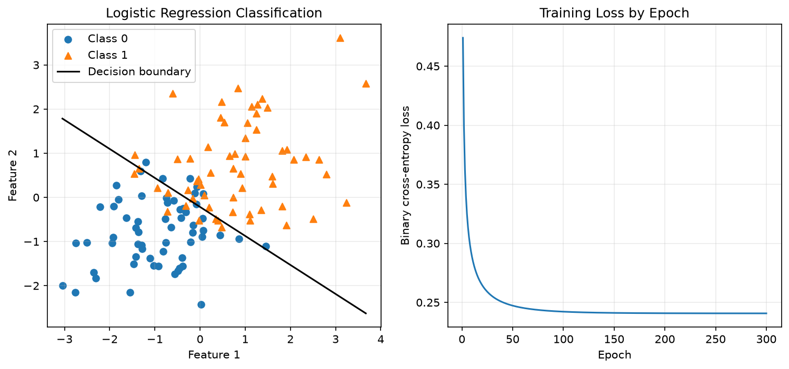
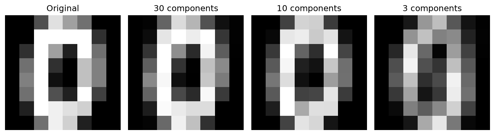

# ML From Scratch

NumPy implementations of core machine learning algorithms, with tests, visual experiments, and comparisons against scikit-learn.

## MLForge V1 planning

The next product is MLForge, a local-first full-screen terminal ML workbench.
Its authoritative plan starts at [docs/v1/README.md](docs/v1/README.md).
Read [How it works](docs/HOW_IT_WORKS.md) for the system flow and
[Extending MLForge](docs/EXTENDING_MLFORGE.md) for practical change locations.
This planning branch contains specifications only; the `mlforge` application
has not been implemented yet. The educational algorithms and instructions below
describe the existing baseline and remain supported.

## Overview

This project focuses on understanding and implementing the mathematical core of common machine learning algorithms instead of relying on library implementations. The algorithms themselves use NumPy; scikit-learn is used only for reference comparisons and datasets.

The project currently includes K-Means clustering, binary Logistic Regression trained with stochastic gradient descent, and Principal Component Analysis using covariance eigendecomposition.

## Algorithms

### K-Means

The K-Means implementation alternates between assigning each sample to its nearest centroid and updating each centroid to the mean of its assigned samples. Training stops when the centroids converge or the maximum number of iterations is reached. The recorded objective is the sum of squared distances from samples to their nearest centroids. A comparison script validates the implementation against scikit-learn.



### Logistic Regression

The binary Logistic Regression implementation uses the sigmoid function to estimate positive-class probabilities, binary cross-entropy as its loss, and stochastic gradient descent for training. Predictions use a linear decision boundary with a probability threshold of 0.5. A comparison script evaluates its learned decision rule against unregularized scikit-learn Logistic Regression.



### Principal Component Analysis

The PCA implementation centers the data, computes its covariance matrix, obtains eigenvalues and eigenvectors, and selects the leading eigenvectors for dimensionality reduction. Reduced observations can be projected back into the original feature space for reconstruction. A comparison script checks the results against scikit-learn PCA.



## Validation

The project contains 15 automated pytest tests covering core behavior, reproducibility, learned values, error handling, and reconstruction. Each implementation is also compared against scikit-learn on the same data:

- K-Means reached the same centroids and objective on the comparison dataset.
- Logistic Regression achieved the same training and test accuracy with very similar learned parameters.
- PCA matched scikit-learn's explained variance and reconstruction error.

These implementations are educational and are not intended as production replacements for scikit-learn.

## Project structure

```text
src/      NumPy algorithm implementations
demos/    Visual examples and scikit-learn comparisons
tests/    Automated pytest tests
assets/   Images used in this README
```

## Installation

Tested with Python 3.13.

Create a virtual environment:

```bash
python -m venv .venv
```

On Windows, install the dependencies directly with the virtual environment's Python:

```powershell
.\.venv\Scripts\python.exe -m pip install -r requirements.txt
```

Activating the virtual environment is optional when using its Python executable directly.

## Running the demos

```bash
python demos/kmeans_demo.py
python demos/logistic_regression_demo.py
python demos/pca_demo.py
```

Each demo displays its visualization and saves the corresponding portfolio image under `assets/`.

## Running comparisons

```bash
python demos/kmeans_comparison.py
python demos/logistic_regression_comparison.py
python demos/pca_comparison.py
```

These scripts compare the NumPy implementations against scikit-learn reference implementations.

## Running tests

```bash
python -m pytest -v
```

## Technologies

- Python
- NumPy
- Matplotlib
- scikit-learn (validation and datasets only)
- pytest
