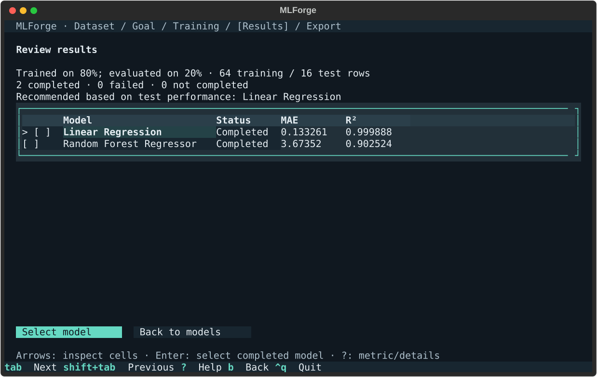

# MLForge

**A local-first terminal application that takes a tabular dataset from raw file to an evaluated model and an installable Python package that predicts without MLForge.**

[](https://github.com/noaml21/ml-from-scratch/actions/workflows/verify.yml)


MLForge guides you through loading a CSV, TSV or JSONL file, checking its column types, choosing a goal, training and comparing scikit-learn models, trying predictions and exporting the exact evaluated pipeline as a wheel. Everything runs on your machine in a full-screen, keyboard-driven terminal UI built with [Textual](https://textual.textualize.io/). Your data is never uploaded.



## What is MLForge?

MLForge makes the decisions in a small machine-learning project visible and safe by default. It shows the detected schema, explains why columns are or are not usable as features, splits supervised data before any preprocessing is fitted, and reports holdout metrics rather than training scores. The model you inspect and try is exactly the model you export.

- **Formats:** CSV, TSV and flat JSONL, with full-table type inference and correctable column types
- **Goals:** classification, regression, clustering (K-Means) and dimensionality reduction (PCA)
- **Guided setup:** target and feature suggestions with reasons, leakage and high-cardinality warnings, an automatic preprocessing summary
- **Training:** each model runs in its own child process with live progress, cancellation and partial results
- **Results:** holdout metrics with a cautious recommendation, confusion matrices, residual summaries, cluster and PCA diagnostics
- **Try:** a typed form for single predictions, with missing-value and out-of-range warnings
- **Export:** an installable wheel with a small `Predictor` API; it needs its pinned numerical dependencies, not MLForge

## Quick start

MLForge supports CPython 3.12 and 3.13 on Linux x86_64 and is verified on Ubuntu 24.04. It is not published on PyPI; install it from source:

```bash
git clone https://github.com/noaml21/ml-from-scratch.git
cd ml-from-scratch
python3.12 -m venv .venv
source .venv/bin/activate
python -m pip install -c requirements/constraints-runtime.txt .
mlforge
```

Press Enter on the welcome screen, then choose **Example dataset** to try it without your own data. Use a terminal of at least 80 × 24. See [Getting started](docs/getting-started.md) for the full walkthrough, keyboard reference and how to use an exported model.

## How it works

```text
Load file → Review types → Choose goal, target and features → Train → Compare → Inspect / Try → Export wheel
```

| Goal | Models | Exported `Predictor` returns (plus `warnings`) |
|---|---|---|
| Predict an outcome (classification) | Logistic Regression, Random Forest | `{"prediction": "<label>"}` |
| Predict a number (regression) | Linear Regression, Random Forest Regressor | `{"prediction": <float>}` |
| Find groups (clustering) | K-Means | `{"cluster": <id>}` |
| Reduce complexity | PCA | `{"components": [...]}` via `transform` |

```python
from my_model import Predictor

model = Predictor()
model.predict({"age": 32, "income": 14500, "region": "North"})  # your selected features
# {"prediction": "retained", "warnings": []}
```

## Engineering highlights

- **No leakage by construction.** For supervised goals, rows are split before anything is fitted; imputation, encoding and scaling learn from training rows only, separately for each candidate.
- **One pipeline, end to end.** The fitted pipeline that produced the displayed metrics is the one Try uses and Export ships. Nothing is silently refitted on all rows.
- **One prediction runtime.** The app and every exported wheel share the same inference code, which validates inputs and checks the bundled model's integrity and versions before use.
- **Owned child processes.** Parsing, training, prediction and export run in supervised subprocesses with deadlines, cancellation, reaping and integrity-checked results, so the UI stays responsive.
- **Safe export.** Wheels are built offline, verified in a separate interpreter against the in-app predictions, and published without overwriting files. They contain no original rows.
- **Enforced boundaries.** An AST-based test keeps the core free of UI imports and enforces the documented module dependency table.

Read [How MLForge works](docs/HOW_IT_WORKS.md) for the architecture.

## Quality and verification

- **707 automated tests** pass locally and in CI on Python 3.12 and 3.13 for the release candidate.
- Fresh **wheel and sdist installations** are exercised end to end outside the checkout: keyboard-driven journeys for all four goals, real-terminal sessions, network access blocked in every process.
- **Exported models are installed into isolated environments** without MLForge, Textual or Rich, and must reproduce the in-app predictions for all six models.
- `python scripts/verify_release.py` runs the complete release verification offline (after a one-time `--prepare-wheelhouse`).

Details: [Development and testing](docs/development.md) · [V1 build report](docs/v1/V1_BUILD_REPORT.md)

## Documentation

| Guide | Covers |
|---|---|
| [Getting started](docs/getting-started.md) | Install, walkthrough, keyboard, Try, export, troubleshooting |
| [How MLForge works](docs/HOW_IT_WORKS.md) | Architecture, data flow and ownership |
| [Development and testing](docs/development.md) | Setup, test suites, verifiers, CI |
| [Extending MLForge](docs/EXTENDING_MLFORGE.md) | Where a new model, importer or screen belongs |
| [ML from scratch](docs/ml-from-scratch.md) | The NumPy K-Means, Logistic Regression and PCA implementations |
| [All documentation](docs/README.md) | Including the V1 specifications and engineering record |

## Limitations

MLForge is deliberately narrow. It handles small tables (up to 20 MiB, 20,000 rows and 100 columns) with a single holdout split; there is no cross-validation, hyperparameter tuning, time-series or grouped splitting, and no deep learning. Exported models need the same Python minor version on Linux x86_64 with the pinned dependencies. Learned categories and labels in an exported model can still reveal information about the training data.

## Also in this repository

This project grew out of [ML from scratch](docs/ml-from-scratch.md): NumPy implementations of K-Means, Logistic Regression and PCA with tests, visual demos and comparisons against scikit-learn. They remain part of the test suite and are documented separately.

## License

MIT. See [LICENSE](LICENSE).
