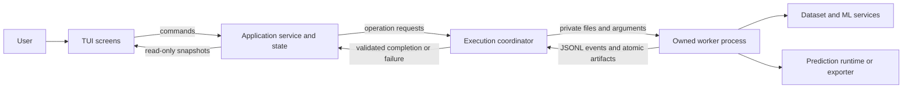
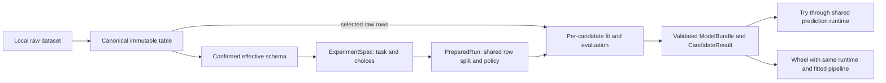

# How MLForge works

Implementation walkthrough: packaging/bootstrap, core/dataset records, model factories, shared inference, unfitted transforms and wheel export exist; bounded local importers, full-table schema inference/overrides and local Prepare services also exist; task eligibility/review policy and shared split preparation are implemented; training-only fitting, task evaluation/ranking and immutable evaluated bundles are implemented; bounded execution protocol and owned-file validation are implemented; headless worker dispatch, process supervision and serial candidate orchestration are implemented; parent-only export publication and cancellation staging cleanup are implemented; immutable application state and invalidation rules are implemented; application load/type-review and owned session cleanup are implemented; training/prediction/export adapters and TUI remain planned. Start with [AGENTS](../AGENTS.md); the authoritative boundaries are in [ARCHITECTURE](v1/ARCHITECTURE.md). The six synthetic model exports also pass real isolated consumer installations; application/Try integration remains planned. During implementation keep these planned paths aligned with real files.

MLForge turns a small local table into a tested model and a reusable Python package, entirely through a terminal application. [PRODUCT_SPEC](v1/PRODUCT_SPEC.md) defines the four tasks and deliberately small scope. The original NumPy algorithms remain the educational track alongside the new workbench.

## One view of control flow

Arrows show control/data movement, not Python import permissions. The coordinator owns subprocesses; the application owns the session. The worker imports the operation's core service, never the application. Detailed wire limits, cancellation and dependency rules have one owner: ARCHITECTURE.

## From file to useful model

The table stays immutable. The effective schema is an interpretation over it. PreparedRun records which rows to use; it does not contain transforms learned from the holdout. A ModelBundle contains learned state needed for inference, not a copy of the dataset. [DATASET_SPEC](v1/DATASET_SPEC.md), [ML_PIPELINE](v1/ML_PIPELINE.md) and [EXPORT_SPEC](v1/EXPORT_SPEC.md) own exact semantics.

## What happens when Train is pressed?
1. The screen sends a command to `application/service.py`. The service verifies the confirmed choices/warning acknowledgements, freezes an ExperimentSpec, increments run identity and locks configuration. Widgets do not fit models.
2. The service asks `execution/coordinator.py` for preparation. A worker calls `preprocessing.py` with validated task rules from `tasks.py`; it records a single reproducible split and policy as PreparedRun. Expensive validation/normalization is off the UI loop.
3. The coordinator launches candidate operations sequentially. `execution/worker.py` dispatches to `training.py`. That function obtains the estimator from `models.py`, builds its transforms in `preprocessing.py`, fits only the permitted training rows, and calls `evaluation.py`. Unsupervised tasks use their specified all-row exploration policy.
4. The worker writes bounded JSONL progress and private atomic result files. It never sends an estimator over stdout. The coordinator drains streams, checks exit status, run/revision identity and output integrity. A completion message alone cannot create an accepted result.
5. The application accepts a CandidateResult into its current run and publishes a snapshot. Results screens format numbers and diagnostics; they do not recompute or rerank models themselves. Model-local failures permit the next candidate; corrupt shared state aborts the run.

Cancel goes to the coordinator, which stops scheduling and terminates/reaps the owned process group. The screen displays Stopping until cleanup completes. Changing accepted configuration invalidates dependent results; stale events cannot resurrect them. See [ARCHITECTURE](v1/ARCHITECTURE.md) for the exact invalidation table and race rules.

## Try and export share what was evaluated
Selection retains the accepted bundle handle; it never retrains. Try sends validated feature input to a prediction operation that loads that bundle through `prediction/runtime.py`. The wheel exporter copies that same maintained runtime source as `_runtime.py` and includes the same fitted pipeline. Normalization/validation is shared rather than reimplemented in widgets or a separate export template. A fresh-environment test compares app and installed-package predictions. Export never silently fits on all rows.

The application runs without network access. Sensitive intermediate files remain in an owned local temporary directory and are cleaned on normal exit. A generated model can retain learned categories/labels; local-first does not imply anonymization. Version/trust limits are specified in EXPORT_SPEC.

## Where to look first
| Question/change | Start here |
|---|---|
| What is included, and why? | PRODUCT_SPEC and REPOSITORY_AUDIT in docs/v1 |
| Who owns choices/results? | application/state.py and service.py |
| Which rows/transformations are learned? | preprocessing.py and ML_PIPELINE |
| Where does fit happen? | training.py, invoked by execution/worker.py |
| Why did a child fail or cancel? | execution/coordinator.py and protocol.py |
| Where does a new capability go? | [EXTENDING_MLFORGE](EXTENDING_MLFORGE.md) |
| How does development resume? | [BUILD_STATE](v1/BUILD_STATE.md) and [RESUME_PROTOCOL](v1/RESUME_PROTOCOL.md) |

This is explainable engineering: data records make boundaries testable, revisions prevent stale state, processes make cancellation real, and one runtime prevents prediction drift. The design needs no plugin platform or enterprise framework to achieve those properties.

Implemented P02 records live in `src/mlforge/contracts.py` and `datasets/records.py`; model descriptions/factories live in `models.py`. Parent-facing ModelBundle uses an opaque directory plus immutable JSON metadata/hashes; it never exposes a fitted estimator. The AST guard in `tests/mlforge/test_architecture.py` enforces imports for modules present so far and fresh headless imports. Future services in the diagrams are not yet implemented.

P02.2 implements `preprocessing.build_pipeline`, `prediction.runtime.Predictor`, `prediction.schema.fitted_schema/save_bundle` and `export.wheel.export_wheel`. The provisional synthetic fixtures fit each candidate independently; canonical import/split/training is still P03/P04 work. Export validates its accepted handle, copies the same runtime and fitted state, checks distribution metadata/RECORD and separate-process prediction parity, then publishes without overwrite. Fresh consumer installation is a separate P02.3 gate and must not be inferred from ZIP imports.

P05 now has an explicit headless worker and a generic process supervisor. `Coordinator.run` returns an immutable transport outcome after group cleanup and artifact validation; only the application may turn it into current semantic state. Cancellation is acknowledged synchronously and awaited to completion. The supervisor never retains raw stderr. Linux descendant reaping is limited to the operation-owned group; normal close removes only its private session directory.

Serial execution is now implemented by `Coordinator.run_many`. Each candidate is fully reaped before the next starts. Accepted outcomes remain available when another candidate fails or queued work is cancelled. Application code supplies semantic abort policy and the shared run deadline; the supervisor does not know estimator or metric rules.

Export cancellation also has parent-owned disk cleanup: the application reserves `Coordinator.publication_staging` on the chosen filesystem and supplies that directory to the worker. Forced termination can bypass a child’s `finally` block, so the parent removes that exact private staging directory after reaping. The worker only stages and returns a receipt; after exit/reaping the parent checks identity, hash, size, cancellation and deadline before publishing the complete wheel without replacement. It preserves unrelated destination files and accepted wheels.

`application/state.py` contains immutable session/configuration/run snapshots. `application/service.py` owns commands, invalidation, operation revision/sequence guards and selection of accepted candidates. Screens must never maintain a parallel committed experiment. Use `async with Service()`, `load(path)` and `change_type(column_id, kind)` for real worker-backed dataset operations; `None` resets a type. `cancel()` acknowledges immediately; `close()` awaits owned work and cleanup while blocking new commands. Training/prediction/export adapters remain the next P05.3 slice.
