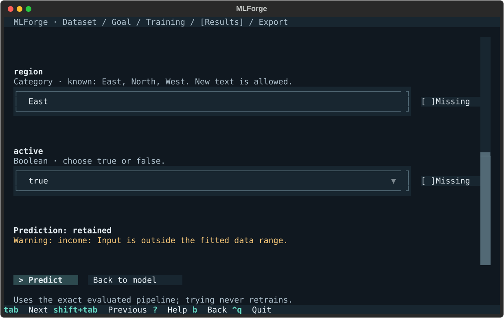

# Getting started with MLForge

This guide covers installing MLForge, a first session, the keyboard, trying a model, exporting it and using the exported package.

## Requirements

- Linux x86_64 with CPython 3.12 or 3.13 (verified on Ubuntu 24.04; other platforms are untested)
- A terminal of at least 80 × 24 characters; 100 × 30 is the primary layout
- Network access only while installing dependencies. MLForge itself never uses the network.

## Install

MLForge is installed from source; it is not published on PyPI.

```bash
git clone https://github.com/noaml21/ml-from-scratch.git
cd ml-from-scratch
python3.12 -m venv .venv
source .venv/bin/activate
python -m pip install -c requirements/constraints-runtime.txt .
mlforge --version
```

The constraints file pins the exact dependency versions that were tested. For a development install with tests and demos, see [Development and testing](development.md).

## A first session

Run `mlforge`. Every step is keyboard-driven and stays inside the terminal.

1. **Welcome.** Press Enter.
2. **Load dataset.** Browse local files, enter a path, or pick an **Example dataset**. Five synthetic examples cover every goal, including one with mixed types and missing values.
3. **Review your dataset.** Check the row and column counts, detected types and the first 50 rows. Change a column's type if needed (for example, keep a ZIP code as a category), then confirm with **Looks correct**. If the file was not parsed the way you expected, **Preview is not correct** produces a privacy-safe prompt you can copy or save to get help converting it; MLForge never sends it anywhere.
4. **Choose a goal.** Predict an outcome, predict a number, find groups or reduce complexity.
5. **Choose what to predict** (supervised goals only) and **the information to use.** Suggested columns come with reasons. Identifiers and dates are excluded, and possible leakage or very high cardinality must be acknowledged explicitly.
6. **Review automatic preprocessing.** See the train/test split and how missing values, categories and scaling will be handled.
7. **Choose models and train.** Both supervised models start selected; K-Means asks for the number of groups and PCA for the number of components. Training shows real progress and can be cancelled; completed models are kept.
8. **Review results.** Compare holdout metrics, press `?` on a cell for an explanation, and press Enter to select a model.
9. **Selected model.** Inspect diagnostics, try the model, or export it.

## Keyboard

| Key | Action |
|---|---|
| Tab / Shift+Tab | Move between controls |
| Up / Down, Left / Right | Move within lists and tables |
| Enter | Activate or select |
| Space | Toggle a checkbox or list item |
| `?` (F1 in text fields) | Help for the focused item |
| Esc | Close help or a dialog; leave a text field |
| `b` / Esc | Go back (outside text fields) |
| `q` / Ctrl+Q | Quit (Ctrl+Q works everywhere) |

Inside text fields, `q`, `b` and `?` are ordinary characters.

## Try the model

**Try the model** shows one input per selected feature. Mark an input **Missing** to use the default learned from the training rows. Numbers outside the training range are used as entered and flagged with a warning, never clipped. New category text is allowed and uses the fitted unknown-category encoding. Classification shows a label, regression a number, K-Means a cluster ID and PCA its component values. Nothing is retrained.



## Export and use a model

**Export package** asks for a destination folder (default `./exports`), a Python module name (default `my_model`) and a version (default `1.0.0`). It builds one wheel locally, verifies it against the in-app predictions and never replaces an existing file. The wheel contains the exact evaluated pipeline, its input schema and learned categories and labels, but none of your original rows.

Install it in a fresh virtual environment with the same Python minor version:

```bash
python3.12 -m venv model-env
. model-env/bin/activate
python -m pip install exports/my_model-1.0.0-py3-none-any.whl
```

```python
from my_model import Predictor

model = Predictor()  # validates the bundled model, versions and platform
model.predict({"age": 32, "income": None, "region": "North"})
# {"prediction": "retained", "warnings": [{"code": "MISSING_IMPUTED", "field": "income", ...}]}
model.predict_many([...])  # up to 1,000 records, validated as a whole
```

A record must contain exactly the selected feature names; `None` marks a missing value. Regression returns `{"prediction": <float>}`, K-Means `{"cluster": <id>}`, and PCA uses `transform(record)` returning `{"components": [...]}`. Invalid input raises `InputValidationError` naming the field; incompatible environments raise `CompatibilityError`. The package does not need MLForge, Textual or Rich. The full contract is in the [export specification](v1/EXPORT_SPEC.md).

An exported wheel is executable Python: install only wheels from sources you trust.

## Data, privacy and limits

- Inputs: UTF-8 CSV, TSV or flat JSONL, up to 20 MiB, 20,000 rows and 100 columns. The source file is only read, never modified.
- MLForge makes no network requests, has no telemetry and opens no browser. Temporary session files are removed on normal exit.
- Supervised results come from one 80/20 holdout split; clustering and PCA describe all rows. These are useful comparisons, not guarantees of future performance. There is no cross-validation, tuning, or time-series and grouped splitting.
- Exported models support the Python minor version and pinned dependencies they were built with, on Linux x86_64.
- At the maximum input size, loading took 25–31 s and training both classification models 65–84 s on the reference machine (12 CPUs, CPython 3.12.3). `python scripts/measure_peak_input.py` records the timings and memory on yours.

## Troubleshooting

| Message | What to do |
|---|---|
| Resize to at least 80 × 24 | Enlarge the terminal. Your work and any running operation are kept. |
| Clipboard unavailable | The terminal refused the copy request. Select the prompt text or use Save. |
| That wheel already exists | Change the module name, version or destination. Existing files are never replaced. |
| `VERSION_MISMATCH` from an exported model | Create a fresh virtual environment with the Python minor version shown at export and install the wheel there. |
| Missing prepared wheelhouse (verifier scripts) | Run `python scripts/verify_release.py --prepare-wheelhouse` once with network access. |
