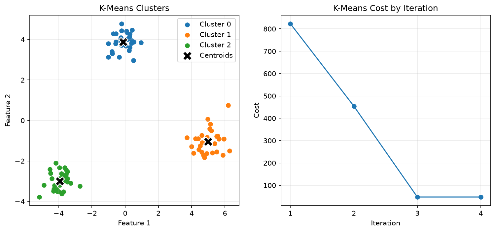
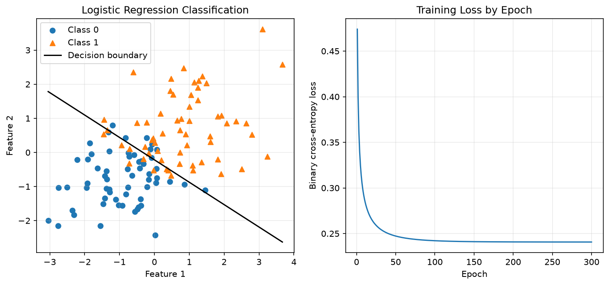
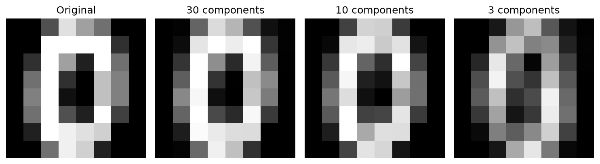

# ML from scratch

The repository began as NumPy implementations of core machine-learning algorithms, with tests, visual experiments and comparisons against scikit-learn. They focus on the mathematics rather than library calls. The algorithms use NumPy only; scikit-learn is used for reference comparisons and datasets.

MLForge itself uses scikit-learn estimators. These implementations remain an educational track: they are part of the test suite but are not the product engine and are not intended as production replacements for scikit-learn.

## K-Means

The implementation alternates between assigning each sample to its nearest centroid and updating each centroid to the mean of its assigned samples. Training stops when the centroids converge or the maximum number of iterations is reached. The recorded objective is the sum of squared distances from samples to their nearest centroids.



## Logistic Regression

Binary Logistic Regression uses the sigmoid function to estimate positive-class probabilities, binary cross-entropy as its loss, and stochastic gradient descent for training. Predictions use a linear decision boundary with a probability threshold of 0.5.



## Principal Component Analysis

PCA centers the data, computes its covariance matrix, obtains eigenvalues and eigenvectors, and selects the leading eigenvectors for dimensionality reduction. Reduced observations can be projected back into the original feature space for reconstruction.



## Validation

Fifteen pytest tests cover core behavior, reproducibility, learned values, error handling and reconstruction. Each implementation is also compared against scikit-learn on the same data:

- K-Means reached the same centroids and objective on the comparison dataset.
- Logistic Regression achieved the same training and test accuracy with very similar learned parameters.
- PCA matched scikit-learn's explained variance and reconstruction error.

## Running

With the development environment from [Development and testing](development.md) (or the standalone `requirements.txt`):

```bash
python demos/kmeans_demo.py                    # visual demos; each saves its image under assets/
python demos/logistic_regression_demo.py
python demos/pca_demo.py

python demos/kmeans_comparison.py              # comparisons against scikit-learn
python demos/logistic_regression_comparison.py
python demos/pca_comparison.py

python -m pytest -q tests/test_kmeans.py tests/test_logistic_regression.py tests/test_pca.py
```

Code: [`src/kmeans.py`](../src/kmeans.py), [`src/logistic_regression.py`](../src/logistic_regression.py), [`src/pca.py`](../src/pca.py).
